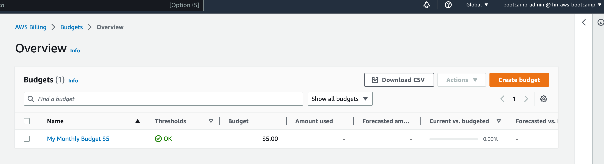
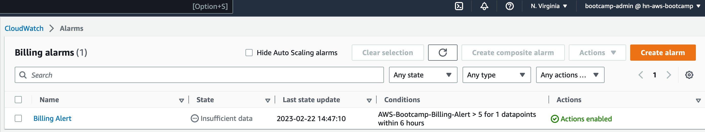

# Week 0 — Billing and Architecture

## Required Homework

#### Install AWS CLI

I decided to use my local instead of Gitpod after so many issues its global enviroments

Here's the steps I used to install it on my Mac:
```
curl "https://awscli.amazonaws.com/awscli-exe-linux-x86_64.zip" -o "awscliv2.zip"
unzip awscliv2.zip
sudo ./aws/install
```
Confirmed it's installed:
```
aws --version
```
### Create a new User and Generate CLI Creds
- In the `IAM Console > User`, I created an admin user 
- Granted it the `AdministratorAccess` and `BillingAccess`
- Also, under for the account to access via AWS CLI, an access key was generated as well:
  - `Security Credentials` > `Create Access Key` > Download the CSV
### Create budget

### Create billing alarm


### Recreate Logical Architecture Design


